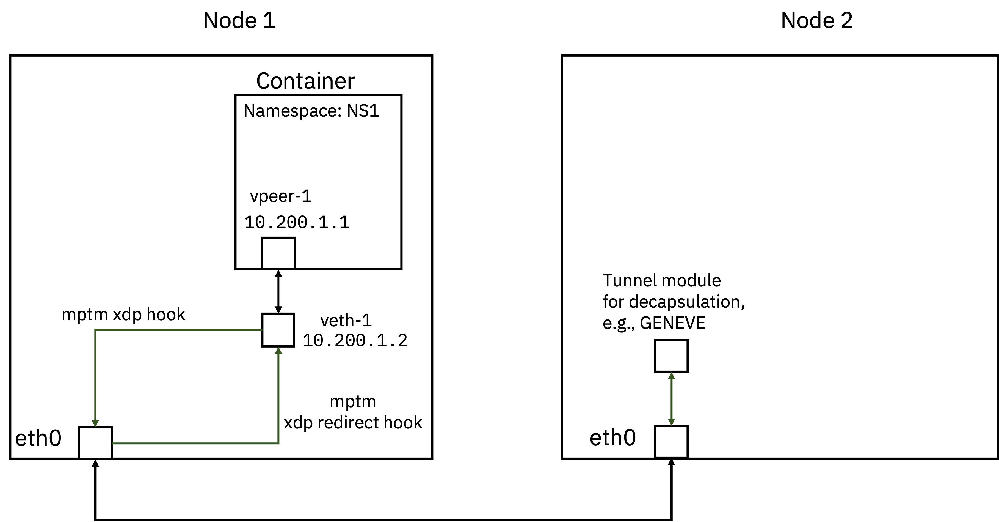

# MPTM

This repository contains code for **Multi Protocol Tunnel Multiplexer (MPTM)** implemented using [ebpf](https://ebpf.io/).
MPTM implements code for multiple tunnel protocols and hooks them in linux at [XDP](https://www.iovisor.org/technology/xdp) hook points.

For detailed description of intent, usage etc. please check the blogs:

1. [Towards building an eBPF Based Network Data Plane](https://medium.com/@palani.kodeswaran/towards-building-a-ebpf-based-network-datapath-f6135067c03e)
1. [Towards building an eBPF based Newtork Data plane: Part 2](https://medium.com/@palani.kodeswaran/towards-an-ebpf-based-datapath-part-2-2afd10ada603)

This code is built on top of the [XDP Tutorial](https://github.com/xdp-project/xdp-tutorial).

## Based on libbpf

This XDP-tutorial leverages [libbpf](https://github.com/libbpf/libbpf/).

## Build

Run ``make`` in root folder.

# How to Run


We provide 2 files to setup system according to the architecture above

[setup-node1.sh](./setup/setup-node1.sh) is for setting up Node 1 while,

[setup-node2.sh](./setup/setup-node2.sh) is for setting up Node 2.


## Attaching MPTM implementation to interfaces:

Load the bpf programs
```
$ cd build/
$ bpftool prog loadall xdp_redirect.o /sys/fs/bpf/xdp-redirect type xdp -d
$ bpftool prog loadall xdp_geneve.o /sys/fs/bpf/xdp-geneve type xdp -d
$ ls /sys/fs/bpf/
xdp-geneve  xdp-redirect
$ bpftool prog show
1236: xdp  name mptm_xdp_geneve  tag 3882107b0c8fafd5  gpl
        loaded_at 2022-05-04T10:58:05+0000  uid 0
        xlated 2640B  jited 1478B  memlock 4096B  map_ids 195,196
        btf_id 250
1237: xdp  name xdp_pass_func  tag 3b185187f1855c4c  gpl
        loaded_at 2022-05-04T10:58:05+0000  uid 0
        xlated 16B  jited 18B  memlock 4096B
        btf_id 250
1241: xdp  name xdp_prog_redire  tag 0af5eaf32951b2e9  gpl
        loaded_at 2022-05-04T10:58:31+0000  uid 0
        xlated 328B  jited 189B  memlock 4096B  map_ids 197
        btf_id 255
```

Attach to the interfaces ingress

```
$ bpftool net attach xdp id 1236 dev v-eth1 overwrite
$ bpftool net attach xdp id 1241 dev geneve0 overwrite
```

## Programming the maps

Check the maps created using below command
```
$ bpftool map show
195: hash  name tunnel_map_ifac  flags 0x0
        key 4B  value 40B  max_entries 30  memlock 12288B
196: percpu_array  name xdp_stats_map  flags 0x0
        key 4B  value 16B  max_entries 5  memlock 8192B
197: hash  name redirect_map  flags 0x0
        key 4B  value 4B  max_entries 30  memlock 8192B
202: array  flags 0x0
        key 4B  value 32B  max_entries 1  memlock 4096B
204: array  name pid_iter.rodata  flags 0x480
        key 4B  value 4B  max_entries 1  memlock 8192B
        btf_id 265  frozen
        pids bpftool(1094964)
205: array  flags 0x0
        key 4B  value 32B  max_entries 1  memlock 4096B
```

Notice the `tunnel_map_ifac` and `redirect_map` needed by `mptm_xdp_geneve` and `xdp_prog_redirect` respectively

Now pin the maps using these commands below, the map ids are taken from map show command, notice that the `bpftool prog show`
command output lists the *map_ids* being used by the programs, if you see multiple maps then use those *ids* below which are
listed with program.

```
$ bpftool map pin id 195 /sys/fs/bpf/tunnel_map_iface
$ bpftool map pin id 197 /sys/fs/bpf/redirect_map
$ ls /sys/fs/bpf/
redirect_map  tunnel_map_iface  xdp-geneve  xdp-redirect
```

We need to populate the maps with information regarding tunnel, ip address to mangle, mac addresses and interfaces to look for.
We will use the [`xdp_geneve_user`](./xdp_geneve_user.c) binary we compiled in the [build](#build) step to do that.

The binary `xdp_geneve_user` needs [libbpf](./deps/libbpf/) shared library for running which gets compiled on your system the
first time you run `make`. To pass shared libary to the binary at runtime you can use this command,

```
export LD_LIBRARY_PATH=${PWD}/deps/libbpf/src
```

run from inside the root directory of project.

The command format is this.

`xdp_geneve_user -f GENEVE-FLAGS -v VLAN-ID -p SOURCE_PORT -c CAPTURE_INTERFACE -i IFACE_ID_OF_VETH_NODE1_ROOTNS -s IP_ADDRESS_OF_VETH_INSIDE_NODE1_NS -d IP_OF_OTHER_NODE_ETH0 -e VETH_MAC_INSIDE_NS -t MAC_OF_OTHER_NODE_ETH0 -q VETH_MAC_OF_NODE2_ROOT_NS -o ADD`

It will look like this, 

```
$ ./build/xdp_geneve_user -f 0 -v 152 -p 51234 -c 15 -i 18 -s 10.200.1.2 -d 10.10.10.2 -e c6:0e:4b:59:85:dd -t b8:ce:f6:27:93:38 -q 5e:81:0b:8b:15:46 -o ADD
opt: f arg: 0 
opt: v arg: 152 
opt: p arg: 51234 
opt: c arg: 15 
opt: i arg: 18 
opt: s arg: 10.200.1.2 
opt: d arg: 10.10.10.2 
opt: e arg: c6:0e:4b:59:85:dd 
opt: t arg: b8:ce:f6:27:93:38 
opt: q arg: 5e:81:0b:8b:15:46 
opt: o arg: ADD 
Using map dir: /sys/fs/bpf, iface 18 
operation is add, adding tunnel iface entry
```

Check if map entry got created by - 

```
$ bpftool map show
195: hash  name tunnel_map_ifac  flags 0x0
        key 4B  value 40B  max_entries 30  memlock 12288B
196: percpu_array  name xdp_stats_map  flags 0x0
        key 4B  value 16B  max_entries 5  memlock 8192B
197: hash  name redirect_map  flags 0x0
        key 4B  value 4B  max_entries 30  memlock 8192B
206: array  flags 0x0
        key 4B  value 32B  max_entries 1  memlock 4096B
208: array  name pid_iter.rodata  flags 0x480
        key 4B  value 4B  max_entries 1  memlock 8192B
        btf_id 270  frozen
        pids bpftool(1097717)
209: array  flags 0x0
        key 4B  value 32B  max_entries 1  memlock 4096B
$ bpftool map dump id 195
key:
12 00 00 00
value:
0f 00 98 00 00 00 00 00  00 00 00 00 22 c8 02 0a
0a 0a 02 01 c8 0a 5e 81  0b 8b 15 46 c6 0e 4b 59
85 dd b8 ce f6 27 93 38
Found 1 element
```

Add an entry to the redirect map for reverse path traffic as,
`xdp_geneve_user -c CAPTURE_INTERFACE -i IFACE_ID_OF_VETH_NODE1_ROOTNS -r IFACE_ID_OF_GENEVE0_NODE1 -o ADD`

```
$ ./build/xdp_geneve_user -c 15 -i 18 -r 20 -o ADD
opt: c arg: 15 
opt: i arg: 18 
opt: r arg: 20 
opt: o arg: ADD 
Using map dir: /sys/fs/bpf, iface 18 
redirect iface id is set to 20
operation is add, adding redirect entry
$ bpftool map dump id 197
key: 14 00 00 00  value: 12 00 00 00
Found 1 element
```

## Show packets coming on xdp interface

```
$ xdpdump -i v-eth1 -x --rx-capture entry,exit
```

#MANGLE rule should ensure outer ip src becomes eth0 ip

## Generating Traffic:

```
ip netns exec NS1 ping 10.200.
```


# License

Adding info regarding appropriate licenses etc. is WIP.